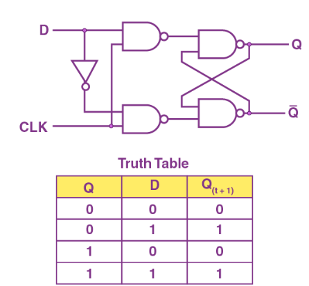

## D Flip-Flop
A D Flip-Flop (Data or Delay Flip-Flop) is a memory element that stores 1 bit of data.

It captures the value of the input D only on the active edge of the clock (rising or falling, depending on design).

The output Q then holds this value until the next active clock edge.

### Working Principle

D flip flop consist of a single input D and two outputs (Q and Q'). The basic working of D Flip Flop is as follows:

-When the clock signal is low, the flip flop holds its current state and ignores the D input.
-When the clock signal is high, the flip flop samples and stores D input.
-The value that was previously fed into the D input is reflected at the flip flop's Q output.
If D = 0 then Q will be 0.
If D = 1 then Q will be 1.
The Q' output of the flip flop is complemented by the Q output. 
If Q = 0 then Q' will be 1.
If Q = 1 then Q' will be 0.

### Advantages of D Flip-Flop
- **Simple Design**: Easy to implement and understand compared to other flip-flops.  
- **High Speed**: Offers faster computation speed.  
- **Low Component Requirement**: Requires fewer components, making it compact and efficient.  
- **Note**: D Flip-Flops can be glitch-prone. If the input `D` changes rapidly near the clock edge, the output `Q` may produce glitches, which are often difficult to detect and fix in digital systems.  

---

### Applications of D Flip-Flop
D Flip-Flops are widely used in digital electronics due to their simplicity and reliability. Some key applications include:

1. **Memory Units**  
   - Used as basic storage elements to hold a single bit of data.  

2. **Registers**  
   - Multiple D Flip-Flops can be combined to form registers, which store multi-bit data in digital systems.  

3. **Counters**  
   - Utilized in designing counters that keep track of the number of events or clock pulses.  

4. **Synchronous Systems**  
   - Essential in developing synchronous digital circuits where data needs to be aligned with the clock signal.  

